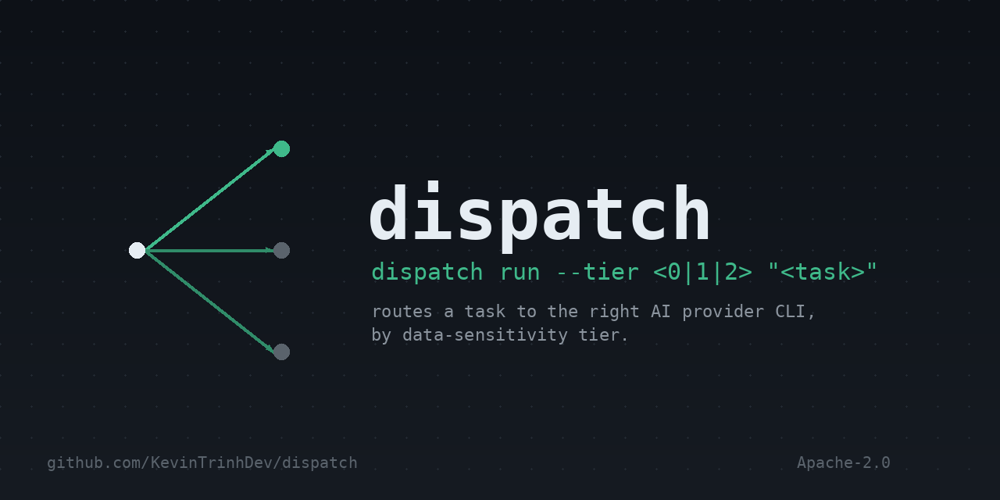

<p align="center">
  
</p>

<p align="center">
  <a href="LICENSE"></a>
  <a href="package.json"></a>
  <a href="src"></a>
  <a href="docs/superpowers/specs"></a>
</p>

Dispatch decides which AI provider CLI should run a given task, and hands it
off — so you don't have to manually pick between a local model, a paid
subscription tool, a metered API, or a browser-driven session every time.

## What it does

```
dispatch run --tier <0|1|2> "<task description>"
```

You tell it two things: the task, and how sensitive the data in that task is
(`--tier`, always required, never guessed). Dispatch then:

1. Looks up which providers are even allowed to see data at that tier.
2. Tries the cheapest eligible one first.
3. Checks the answer actually looks like an answer (not empty, not a refusal).
4. If it doesn't, tries the next eligible provider up, and logs every step.

Add `--explain` to see exactly which provider ran, in what order, and why.

## Features

| | |
|---|---|
| ✅ | Tiered routing (`--tier 0\|1\|2`), always explicit, never inferred |
| ✅ | Cascade-with-verification: cheapest eligible provider first, escalates on empty/refused/failed output |
| ✅ | Adapters for a local model, a metered API, Codex, and Claude Code — all via real installed CLIs, no reimplemented SDKs |
| ✅ | Argv-array subprocess exec only — no shell-string interpolation, no injection surface |
| ✅ | Per-run timeout with SIGTERM → SIGKILL escalation |
| ✅ | Tier-redacted, concurrency-safe audit log (`~/.dispatch/audit.jsonl`) |
| ✅ | Local secret-shaped-content scan as a non-blocking, TTY-aware warning |
| ✅ | `--explain` routing trace with per-attempt status and failure reason |
| 🚧 | `gaze` browser-automation adapter — registered and tier-gated, but a documented stub (see [Status](#status)) |
| ⬜ | Task decomposition / multi-subtask routing |
| ⬜ | Shared memory / knowledge store across runs |
| ⬜ | Broader security-hardening layer (sandboxing, threat model beyond the tier gate) |
| ⬜ | Desktop overlay UI |

## Data tiers

| Tier | Meaning | Example |
|---|---|---|
| 0 | Never leaves this machine | Secrets, private keys, personal legal docs |
| 1 | Your own accounts only | Source code, infra config |
| 2 | Already public | Open-source code, published docs |

Tier is always supplied by you. Dispatch never infers it from task content —
see the [design spec](docs/superpowers/specs/2026-09-05-dispatch-router-design.md)
for why guessing sensitivity automatically was rejected as a design choice.

## How it compares

Dispatch's niche is narrow on purpose: routing across full local CLI agents
(not raw model APIs), keyed primarily on data-sensitivity tier rather than
cost or latency alone.

| | Dispatch | [LiteLLM](https://github.com/BerriAI/litellm) | [cli-agent-orchestrator](https://github.com/awslabs/cli-agent-orchestrator) | [RouteLLM](https://github.com/lm-sys/RouteLLM) |
|---|---|---|---|---|
| Routes across | Installed CLI agents | LLM APIs | Installed CLI agents | LLM APIs |
| Primary routing key | Data-sensitivity tier | Cost / latency | Task assignment | Learned quality/cost tradeoff |
| Escalation strategy | Output verification | Fallback chains | N/A (parallel agents) | Trained classifier |
| Browser-driven chat UIs | Planned (stub in v1) | No | No | No |
| Audit trail | Tier-redacted local log | Provider-side logging | No | No |
| Needs training data | No | No | No | Yes |

None of these combine CLI-agent routing, browser automation, and
sensitivity-tiering the way Dispatch does — see [Why this exists](#why-this-exists)
for the honest version of this argument, including where Dispatch borrows from
each project.

## Why this exists

The closest existing projects each solve part of this problem, not the whole
thing:

- **[LiteLLM](https://github.com/BerriAI/litellm)** unifies routing across LLM
  *APIs* — it has no concept of a local CLI subprocess or a browser session.
- **[AWS Labs' cli-agent-orchestrator](https://github.com/awslabs/cli-agent-orchestrator)**
  orchestrates multiple coding-agent CLIs in parallel — it assumes every task
  is a coding task assigned to several agents at once, not one task routed by
  data sensitivity to one agent.
- **[RouteLLM](https://github.com/lm-sys/RouteLLM)** is prior art for the
  general "cheap-first, escalate if needed" framing this project uses, though
  Dispatch intentionally uses output verification instead of RouteLLM's
  trained classifier approach — see the design spec for the reasoning.

## Roadmap

Each item below is a separate, not-yet-started project with its own future
design spec — not a task on this repo's current backlog:

- [ ] Real `gaze` browser-automation flow (multi-step goto/fill/press/scrape,
      replacing the current stub)
- [ ] Task decomposition: split one large task into routed subtasks
- [ ] Shared memory / knowledge store across runs
- [ ] Broader security-hardening layer beyond the tier gate
- [ ] Desktop overlay UI
- [ ] Self-updating tool/provider discovery

## Naming

Originally prototyped under two names that turned out to collide with
existing, much larger projects — `hydra`
([facebookresearch/hydra](https://github.com/facebookresearch/hydra), a
widely-used config framework) and `relay` (Facebook's Relay GraphQL client).
`dispatch` was checked against both npm and GitHub before being locked in.

## Status

v1 covers routing and handoff only. Task decomposition, a shared memory
store, a broader security-hardening layer, and a desktop UI are each
separate, not-yet-started projects.

The `gaze` provider (browser-driven consumer chat UIs) is a **documented stub
in v1**: it is registered in the cascade and correctly excluded from Tier 0,
but its `run` method always returns an `error` result rather than driving a
real browser. Relaying a task to a browser-based chat needs a multi-step flow
(navigate, fill the input, submit, wait, scrape the response) that doesn't fit
the one-shot shell-command shape every other adapter uses; building that
properly is follow-up work, not part of v1. Dispatch will simply escalate past
`gaze` to the next eligible provider until that lands.

See
[the design spec](docs/superpowers/specs/2026-09-05-dispatch-router-design.md#11-open-items-for-future-specs-not-this-one)
for the full list.

## License

Apache-2.0. See [LICENSE](LICENSE).
